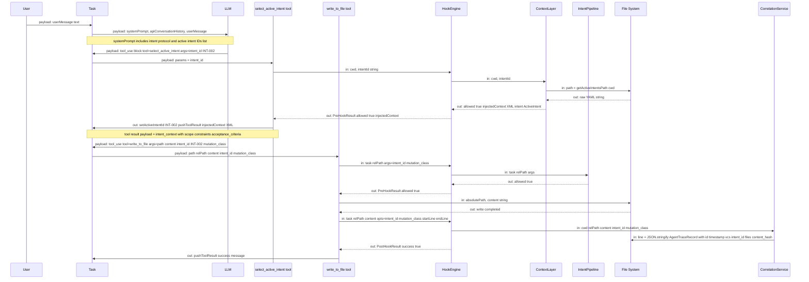

# TRP1 Roo Code: Intent-Driven Orchestration — Implementation Report

**Project:** Intent-code traceability and orchestration layer on top of Roo Code  
**Deliverable:** Complete implementation report with architecture, schemas, agent flow, and reflective summary.

---

## 1. Executive Summary

This report documents the implementation of an **intent-driven orchestration layer** inside the Roo Code VS Code extension. The layer adds governance and traceability without changing how Roo Code behaves when the feature is not used: when the workspace has no `.orchestration/` directory, all existing tools and flows work as before. When `.orchestration/` exists, the agent must declare which intent it is working on before writing code, and every write is checked (gatekeeper) and recorded (trace) so that intent, code, and history stay linked. The design explicitly targets the problem domain of **Cognitive Debt** (knowledge decay from AI-generated code without captured “why”), **Trust Debt** (lack of verification that changes align with intent), and **Context Engineering** (structured, injected context so the agent acts within scope and constraints). Section 7 maps each implemented component to these concepts. The implementation uses a **pluggable hook system** (pre- and post-write), a **shared data model** under `.orchestration/`, and **clear execution states** (request → handshake → contextualized action) that are described in full below, including visual flow diagrams with data payloads and failure paths.

---

## 2. Complete Implementation Architecture & Schemas

### 2.1 High-Level Architecture

The extension is structured in three main layers:

| Layer              | Role                                                         | Notes                                                               |
| ------------------ | ------------------------------------------------------------ | ------------------------------------------------------------------- |
| **Webview**        | UI only; talks to the host via `postMessage`.                | Does not read files or run tools.                                   |
| **Extension Host** | Conversation state, API calls to the LLM, and tool dispatch. | Task, `presentAssistantMessage`, and tool `handle()` live here.     |
| **Hook Engine**    | Middleware around writes: intent checks, scope, trace.       | All mutating tools call the hook before and after the actual write. |

The “agent” is not a single process; it is **Task + presentAssistantMessage + tools**. The LLM receives the system prompt and conversation history and emits `tool_use` blocks. The host runs each block through the corresponding tool. Tools that change the workspace (e.g. `write_to_file`, `edit`, `apply_patch`, `edit_file`, `search_replace`, `select_active_intent`) go through the hook layer so that intent validation and trace recording are centralized and consistent.

Persistence is **file-based** under the workspace root in a directory named `.orchestration/`. There is no vector database; all orchestration state lives in YAML, JSONL, and Markdown files described in the schemas below.

### 2.2 Orchestration Data Model and Schemas

#### 2.2.1 Active intents (`active_intents.yaml`)

The catalog of intents the agent is allowed to work on. Each intent has an ID, name, status, scope, constraints, and acceptance criteria.

**TypeScript interfaces (from `src/hooks/orchestration-types.ts`):**

```ts
export type IntentStatus = "DRAFT" | "IN_PROGRESS" | "COMPLETED"

export interface ActiveIntent {
	id: string
	name: string
	status: IntentStatus
	owned_scope: string[] // Glob patterns, e.g. ["src/**", "*.ts"]
	constraints: string[]
	acceptance_criteria: string[]
}

export interface ActiveIntentsDoc {
	active_intents: ActiveIntent[]
}
```

**Example `.orchestration/active_intents.yaml`:**

```yaml
active_intents:
    - id: "INT-001"
      name: "Build Weather API"
      status: "IN_PROGRESS"
      owned_scope: ["src/**", "*.ts"]
      constraints:
          - "Use TypeScript"
          - "No external auth for demo"
      acceptance_criteria:
          - "API returns weather for a given city"
    - id: "INT-002"
      name: "JWT Authentication Migration"
      status: "DRAFT"
      owned_scope: ["src/auth/**", "src/middleware/jwt.ts"]
      # ...
```

The hook layer reads this file to validate intent IDs and to build the context that is injected when the agent calls `select_active_intent`.

#### 2.2.2 Agent trace (`agent_trace.jsonl`)

Append-only log: one JSON object per line. Each line represents one write event and links it to an intent, a file path, a content hash, and optional metadata (e.g. VCS revision, session, model).

**TypeScript interfaces:**

```ts
export type MutationClass = "AST_REFACTOR" | "INTENT_EVOLUTION"

export interface AgentTraceRange {
	start_line: number
	end_line: number
	content_hash: string // e.g. "sha256:" + first 32 hex chars of SHA-256
}

export interface AgentTraceConversation {
	url: string
	contributor: { entity_type: "AI" | "human"; model_identifier?: string }
	ranges: AgentTraceRange[]
	related: Array<{ type: string; value: string }> // e.g. { type: "specification", value: "INT-001" }
}

export interface AgentTraceFile {
	relative_path: string
	conversations: AgentTraceConversation[]
}

export interface AgentTraceRecord {
	id: string
	timestamp: string
	vcs: { revision_id: string }
	files: AgentTraceFile[]
	intent_id?: string
	mutation_class?: MutationClass
}
```

- **content_hash:** SHA-256 of the written content (UTF-8), truncated to a prefix (e.g. `sha256:abc123...`) for compact, deterministic identity of that version of the file.
- **mutation_class:** `AST_REFACTOR` for refactors within the same intent; `INTENT_EVOLUTION` for new behavior or features.
- **related:** Used to tie the record to the intent (e.g. `type: "specification", value: intent_id`).

All paths in the trace are relative to the workspace root. The file is created and appended to by the post-write hook only when orchestration is enabled and an `intent_id` is present.

#### 2.2.3 Other orchestration artifacts

- **`intent_map.md`** — Human-readable summary of intents and plan; can be edited by the user or by an “architect” agent.
- **`CLAUDE.md`** — Shared “lessons learned”; the `record_lesson` tool appends to it when a verification step (e.g. linter or test) fails so other agents can avoid the same mistake.
- **`.intentignore`** (optional, at workspace root) — List of path patterns excluded from the selected intent’s scope; edits to those paths are blocked when orchestration is on.

Paths and I/O for these files are centralized in `src/hooks/orchestration-io.ts` (e.g. `getOrchestrationDir`, `getAgentTracePath`, `readActiveIntents`, `appendAgentTrace`).

### 2.3 Hook System Architecture

The hook system is built so that new behavior can be added without changing the core tool or host logic.

- **HookEngine** — Public API used by tools: `preWriteFile`, `postWriteFile`, `preSelectActiveIntent`, etc. It is a thin facade over HookManager.
- **HookManager** — Delegates pre/post write to the registry and delegates intent context to the ContextLayer. It also exposes get/set for the task’s active intent and read-hash map (used for optimistic locking).
- **HookRegistry** — Holds ordered lists of pre-write and post-write hooks. Each hook implements a small interface (`IPreWriteHook` or `IPostWriteHook`). Lower order runs first; the first pre-write hook that returns `allowed: false` stops the chain and blocks the write.

**Formal hook interfaces (`src/hooks/hook-types.ts`):**

```ts
export interface PreHookResult {
	allowed: boolean
	message?: string
	injectedContext?: string
	intent?: ActiveIntent
}

export interface PostHookResult {
	success: boolean
	message?: string
}

export interface IPreWriteHook {
	readonly name?: string
	execute(task, relPath, args): Promise<PreHookResult>
}

export interface IPostWriteHook {
	readonly name?: string
	execute(task, relPath, content, opts): Promise<PostHookResult>
}
```

**Default hooks (registered at extension load in `src/hooks/default-hooks.ts`):**

1. **Pre-write: intent-pipeline** — Calls `validateIntentForWrite` (IntentPipeline). Checks that a valid intent is set (or inferred), that the file is in scope, not in `.intentignore`, and passes the optimistic lock (read-hash) check. Returns `allowed: false` and a message (e.g. “You must cite a valid active Intent ID.”) when any check fails.
2. **Post-write: trace** — Calls `appendWriteTrace` (CorrelationService) only when `opts.intent_id` is set. Appends one line to `agent_trace.jsonl` with the structure above. Failures are logged and do not change the tool’s success result.

Registration happens by importing the hooks index at startup so that the registry is populated before any tool runs.

**Critical wiring:** In `src/extension.ts`, the following line runs when the extension loads:

```ts
import "./hooks" // Registers default orchestration hooks (trace, intent pipeline).
```

Without this import, the hooks index (and thus `registerDefaultHooks()`) would never run, so the gatekeeper and trace would not be active. This was identified and fixed during implementation.

### 2.4 File Layout (hooks and orchestration)

```
src/
  extension.ts              # Imports "./hooks" so default hooks register
  hooks/
    index.ts                 # Calls registerDefaultHooks(); re-exports hook API
    default-hooks.ts         # Defines and registers intent-pipeline + trace hooks
    HookEngine.ts            # Public API for tools
    HookManager.ts           # Delegates to registry and ContextLayer
    HookRegistry.ts         # Ordered pre/post write hook lists
    hook-types.ts            # IPreWriteHook, IPostWriteHook, PreHookResult, PostHookResult
    orchestration-types.ts   # ActiveIntent, AgentTraceRecord, MutationClass, etc.
    orchestration-io.ts      # Paths and read/write for .orchestration/* and .intentignore
    taskState.ts             # get/set active intent ID and read-hash per task
    content-hash.ts          # SHA-256 and contentHashPrefix for trace
    scope-match.ts           # pathMatchesScope(relPath, patterns)
    prompt-intent-match.ts   # getLastUserMessageText, promptMatchesIntent
    pipeline/
      IntentPipeline.ts      # validateIntentForWrite (gate + intent inference)
    context/
      ContextLayer.ts        # getIntentContext, buildIntentContextXml
    correlation/
      CorrelationService.ts # appendWriteTrace → agent_trace.jsonl
  core/
    prompts/
      system.ts              # Builds full system prompt
      sections/
        intent-protocol.ts   # Intent protocol section when .orchestration/ exists
    tools/
      WriteToFileTool.ts     # Calls preWriteFile / postWriteFile; gatekeeper + trace
      EditTool.ts, ApplyPatchTool.ts, EditFileTool.ts, SearchReplaceTool.ts  # Same
      SelectActiveIntentTool.ts  # Calls preSelectActiveIntent; sets active intent
      ExecuteCommandTool.ts  # Gatekeeper for file-writing commands
      RecordLessonTool.ts    # Appends to CLAUDE.md
```

Orchestration artifacts live under the workspace root:

```
.orchestration/
  active_intents.yaml
  agent_trace.jsonl
  intent_map.md
  CLAUDE.md
.intentignore   (optional, at workspace root)
```

---

## 3. Agent Flow & Hook System Breakdown

### 3.1 End-to-End Agent Flow (Simplified)

1. **User sends a message** (e.g. “Refactor the auth middleware” or “Work on INT-001. Add a WeatherResponse type.”).
2. **Task builds the request:** System prompt (including the intent protocol if `.orchestration/` exists), conversation history, and the new user message are sent to the LLM.
3. **LLM returns content blocks:** Typically a mix of text and `tool_use` blocks (e.g. `select_active_intent`, `read_file`, `write_to_file`).
4. **presentAssistantMessage** walks the blocks and, for each `tool_use`, calls the corresponding tool’s `handle()` with the task and callbacks.
5. **For `select_active_intent(intent_id)`:**  
   The tool calls `hookEngine.preSelectActiveIntent(cwd, intentId)`. The ContextLayer loads the intent from `active_intents.yaml`, checks that it exists, and returns an XML block with that intent’s context. The tool then sets the active intent on the task and pushes that context as the tool result. The agent now “has” that intent for the rest of the turn.
6. **For `write_to_file` (and other write tools):**
    - **Pre-hook:** The tool calls `hookEngine.preWriteFile(task, relPath, args)`. The registry runs the intent-pipeline hook. If the hook returns `allowed: false`, the tool pushes the error message (e.g. “You must cite a valid active Intent ID.”), sets `task.gatekeeperBlockedThisTurn = true`, and returns without writing.
    - **Write:** If `allowed: true`, the tool performs the usual diff, approval, and file write.
    - **Post-hook:** The tool calls `hookEngine.postWriteFile(task, relPath, content, opts)`. The registry runs the trace hook, which appends one record to `agent_trace.jsonl` when `intent_id` is present.
7. **Gatekeeper behavior:** If the gatekeeper blocked, no further tools are executed in that turn (see Section 4), and the task loop exits without pushing a follow-up request onto the stack, so no extra API call is made.

### 3.2 The Three-State Execution Flow (Handshake Model)

The implementation follows a three-state flow that matches the “reasoning intercept” (handshake) design.

**State 1 — The request**  
The user types something like: “Refactor the auth middleware.” That message is added to the conversation and sent to the LLM. The system prompt (when `.orchestration/` exists) tells the model that it must not write code immediately and must first call `select_active_intent(intent_id)` to load context.

**State 2 — The reasoning intercept (the handshake)**  
The agent is expected to analyze the request, pick an intent ID from the list in the prompt (e.g. INT-001 or INT-002), and call the mandatory tool: `select_active_intent(intent_id)`.  
When the host runs that tool:

- The **pre-hook** intercepts the call. It looks up the intent in the data model (`active_intents.yaml`) and loads that intent’s constraints, scope, and acceptance criteria.
- The hook builds a structured block (XML) with that context and returns it as the tool result.
- The tool stores the selected intent ID on the task and pushes the context block back into the conversation.

So the execution loop is “paused” in the sense that the agent must complete this step before it is allowed to write; the hook does not call the LLM itself — it only queries the data model and injects the result into the conversation so the next model turn has the right context.

**State 3 — Contextualized action**  
The agent now has the injected context and can call tools such as `read_file` and `write_to_file`. When it calls `write_to_file` (or another mutating tool):

- The **pre-hook** runs again: it checks that a valid intent is set (or inferred from the user message), that the target file is in scope, and that the optimistic lock (if any) is satisfied. If not, it blocks and returns an error.
- If allowed, the tool performs the file write.
- The **post-hook** runs: it computes the content hash of what was written, builds an `AgentTraceRecord`, and appends one line to `agent_trace.jsonl`, linking the write to the `intent_id` chosen in State 2.

So the trace always links the code change back to the intent that was selected in the handshake. The content hash gives a compact, deterministic identity for that version of the file for later comparison or auditing.

### 3.3 Where Pre- and Post-Hooks Run

- **Pre-write hook** runs inside every mutating tool’s `execute()` **before** any file write or approval UI. For example, in `WriteToFileTool.ts`, the tool calls `hookEngine.preWriteFile(task, relPath, { intent_id, mutation_class })` at the start; if the result is `allowed: false`, the tool returns immediately and never writes. The same pattern is used in `EditTool`, `ApplyPatchTool`, `EditFileTool`, `SearchReplaceTool`, and in `ExecuteCommandTool` for file-writing commands (with a separate gatekeeper check).
- **Post-write hook** runs **after** the file has been written and the tool is about to push a success result. For example, in `WriteToFileTool.ts`, after a successful write the tool calls `hookEngine.postWriteFile(task, relPath, newContent, opts)`. The same call is added in the other write tools (Edit, ApplyPatch, EditFile, SearchReplace) so that trace is recorded regardless of which tool the model used. The trace hook only appends when `opts.intent_id` is present; otherwise it returns success without writing to the file.

The flow is: **Tool → HookEngine → HookManager → HookRegistry → registered hooks (IntentPipeline, CorrelationService) → orchestration-io (and ContextLayer for select_active_intent).**

### 3.4 Visual Flow Diagrams (Sequence and Data Payloads)

The following diagrams illustrate the chronological flow, hook interruptions, and **explicit data payloads on each edge** so the flow doubles as a behavioral specification. Every arrow is labeled with the payload (inputs and outputs) for that step.

#### 3.4.1 Happy Path: Intent Selection Then Write (With Data Payloads)

This sequence shows the full handshake and write; each arrow label is the data payload for that call or return.



**Payload summary (happy path):**

| Step                        | From → To                              | Data payload                                                                                                                                                                                                                     |
| --------------------------- | -------------------------------------- | -------------------------------------------------------------------------------------------------------------------------------------------------------------------------------------------------------------------------------- |
| Intent protocol in prompt   | System → LLM                           | List of active intent IDs; mandate to call `select_active_intent` first.                                                                                                                                                         |
| select_active_intent result | Hook → Conversation                    | `injectedContext`: XML with `<intent_id>`, `<owned_scope>`, `<constraints>`, `<acceptance_criteria>`.                                                                                                                            |
| Pre-write input             | Tool → Hook                            | `task`, `relPath`, `args: { intent_id?, mutation_class? }`.                                                                                                                                                                      |
| Pre-write output            | Hook → Tool                            | `{ allowed: true }` or `{ allowed: false, message }`.                                                                                                                                                                            |
| Post-write input            | Tool → Hook                            | `task`, `relPath`, `content`, `opts: { intent_id?, mutation_class?, startLine?, endLine? }`.                                                                                                                                     |
| Trace record                | CorrelationService → agent_trace.jsonl | One `AgentTraceRecord`: `id`, `timestamp`, `vcs.revision_id`, `intent_id`, `mutation_class`, `files[].relative_path`, `files[].conversations[].ranges[].content_hash`, `related: [{ type: "specification", value: intent_id }]`. |

#### 3.4.2 Failure Path: Write Without Valid Intent (Gatekeeper Interrupts)

This sequence shows what happens when the agent (or the flow) attempts a write without a valid intent: the pre-hook returns `allowed: false`, the tool does not write, the gatekeeper flag is set, and no further tools run in that turn.

```mermaid
sequenceDiagram
    participant User
    participant Task
    participant LLM
    participant Presenter as presentAssistantMessage
    participant Tool as Write Tool
    participant HookEngine
    participant IntentPipeline

    User->>Task: "Add a new helper in utils.js"
    Task->>LLM: Request (intent protocol present; intent IDs in prompt)
    LLM->>Task: tool_use: write_to_file(path: "src/utils.js", content, no intent_id)
    Note over LLM,Task: Model skipped select_active_intent

    Task->>Presenter: process tool_use block
    Presenter->>Tool: handle(write_to_file, { path, content })
    Tool->>HookEngine: preWriteFile(task, relPath, { intent_id: undefined })
    HookEngine->>IntentPipeline: validateIntentForWrite(task, relPath, args)
    Note over IntentPipeline: No intent on task; user message has no single mentioned intent ID
    IntentPipeline-->>HookEngine: { allowed: false, message: "You must cite a valid active Intent ID." }
    HookEngine-->>Tool: PreHookResult { allowed: false, message }
    Tool->>Task: pushToolResult(error); gatekeeperBlockedThisTurn = true
    Tool-->>Presenter: return (no file write)

    Note over Presenter: Next tool_use in same turn
    Presenter->>Presenter: if (gatekeeperBlockedThisTurn) { pushToolError; skip execution }
    Note over Task: Loop: break; clear userMessageContent; guard before stack.push
    Task->>User: Show gatekeeper message; no further API request
```

**Payload summary (failure path):**

| Step                 | From → To             | Data payload                                                                                           |
| -------------------- | --------------------- | ------------------------------------------------------------------------------------------------------ |
| Pre-write output     | IntentPipeline → Tool | `{ allowed: false, message: "You must cite a valid active Intent ID." }`.                              |
| Tool to conversation | Tool → Task           | Error string shown in UI; `task.gatekeeperBlockedThisTurn = true`.                                     |
| Subsequent tool_use  | Presenter             | Checks `gatekeeperBlockedThisTurn`; pushes tool error for current block and does not execute the tool. |
| Task loop            | Task                  | `break`; `userMessageContent = []`; no `stack.push` for follow-up request.                             |

#### 3.4.3 High-Level Three-State Flow (Context and Interrupt Points)

The diagram below summarizes the three states and where the hook engine interrupts the normal tool flow.

```mermaid
flowchart LR
    subgraph State1["State 1: Request"]
        A[User message] --> B[Task builds request]
        B --> C[LLM receives prompt + intent protocol]
    end

    subgraph State2["State 2: Handshake (Intercept)"]
        C --> D[LLM emits select_active_intent]
        D --> E[Hook: ContextLayer loads intent]
        E --> F[Payload: injectedContext XML to conversation]
        F --> G[Task stores active intent ID]
    end

    subgraph State3["State 3: Contextualized Action"]
        G --> H[LLM emits write_to_file]
        H --> I[Hook: IntentPipeline validates]
        I --> J{allowed?}
        J -->|No| K[Block; gatekeeper; exit turn]
        J -->|Yes| L[Tool writes file]
        L --> M[Hook: CorrelationService appends trace]
        M --> N[Payload: AgentTraceRecord to agent_trace.jsonl]
    end

    State1 --> State2 --> State3
```



---

## 4. Fixes Applied During Implementation (From This Chat)

The following issues were found and fixed so that the gatekeeper and trace behave correctly and the UI does not trigger extra API calls after a block.

### 4.1 Hooks Not Running (Trace and Gatekeeper Inactive)

**Problem:** The trace file was never created, and the gatekeeper did not block writes, even when `.orchestration/` existed.

**Cause:** `registerDefaultHooks()` is called only when `src/hooks/index.ts` is loaded. No code path was importing the hooks **index**; tools imported specific files (e.g. `HookEngine`, `orchestration-io`), so the index (and thus the default hooks) were never loaded.

**Fix:** In `src/extension.ts`, add a side-effect import so the hooks module loads at startup:

```ts
import "./hooks" // Registers default orchestration hooks (trace, intent pipeline).
```

After this change, the intent-pipeline pre-write hook and the trace post-write hook are registered and run on every write when orchestration is enabled.

### 4.2 TypeScript: PostWriteTraceOpts Required vs Optional

**Problem:** Pre-push type-check failed: `intent_id` and `mutation_class` were required on `PostWriteTraceOpts`, but the code sometimes called `postWriteFile` when no intent was set (e.g. when orchestration exists but the model had not selected an intent).

**Fix:** In `src/hooks/orchestration-types.ts`, `intent_id` and `mutation_class` were made optional on `PostWriteTraceOpts`. The trace hook already skips appending when `opts.intent_id` is missing, so the runtime behavior stayed correct while satisfying the type checker.

### 4.3 Trace Not Recorded for Some Writes

**Problem:** Trace was only invoked from `WriteToFileTool` and only when `intentId` was already set. Writes done via `edit`, `apply_patch`, `edit_file`, or `search_replace` never called the post-write hook, so they never produced a trace line. Also, `WriteToFileTool` only called the post-hook when `intentId` was truthy, so if the model wrote without selecting an intent, the hook was never run.

**Fix:**

- In `WriteToFileTool`, call `postWriteFile` whenever `orchestrationExists(task.cwd)` (and keep passing `intent_id` / `mutation_class` when available). The trace hook still only appends when `opts.intent_id` is set.
- In `default-hooks.ts`, the trace hook returns early with `success: true` when `!opts.intent_id`, so no invalid record is written.
- In `EditTool`, `ApplyPatchTool`, `EditFileTool`, and `SearchReplaceTool`, after a successful write the same `hookEngine.postWriteFile(...)` call was added, with `intent_id` taken from `getActiveIntentId(task)` and `mutation_class` defaulting to `"AST_REFACTOR"`. Trace is therefore recorded for all write tools when an intent is set.

### 4.4 Gatekeeper Shows but Other Tools Still Run

**Problem:** After the gatekeeper blocked one tool (e.g. `write_to_file`), the UI showed the block, but other tools in the same turn could still run, and the experience was confusing.

**Fix:** In `presentAssistantMessage.ts`, at the start of handling each `tool_use` (and `mcp_tool_use`) block, if `cline.gatekeeperBlockedThisTurn` is already true, the code now pushes a tool error for the current block and breaks without executing the tool. So once the gatekeeper has blocked, no further tools in that turn are executed.

### 4.5 Trace Still Missing When User Said “Work on INT-001”

**Problem:** Even when the user said “Work on INT-001” and the model wrote a file, no trace was written. The model did not always call `select_active_intent` before writing, so `getActiveIntentId(task)` was never set and the trace hook skipped appending.

**Fix:** In `validateIntentForWrite` (IntentPipeline), when no intent ID is set (neither in args nor on the task), the pipeline now tries to **infer** the intent from the last user message. It reads `active_intents.yaml` and checks whether the user’s message contains exactly one of the listed intent IDs (e.g. “INT-001”). If so, it sets that intent on the task with `setActiveIntentId(task, intentId)` and allows the write. The write then proceeds with an intent set, so the post-write hook appends a trace line. The user can therefore say “Work on INT-001. Add a WeatherResponse type” and get a trace even if the model never called `select_active_intent`.

### 4.6 Gatekeeper Blocks but Another API Request Fired

**Problem:** After the gatekeeper blocked and showed the popup, the extension still triggered another API request in the background, so the non–active-intent prompt could still be executed behind the scenes.

**Cause:** The task loop used `continue` after flushing and resetting the gatekeeper flag; the loop would only exit when the stack was empty. In some flows or timing, the stack or follow-up logic could still lead to another request.

**Fix:** In `Task.ts`, when `gatekeeperBlockedThisTurn` is true after processing the assistant response:

- The code now **breaks** out of the request loop instead of continuing, so no further iterations run.
- `userMessageContent` is cleared so nothing is left that could be pushed as a follow-up.
- An extra guard was added immediately before `stack.push(...)`: if `gatekeeperBlockedThisTurn` is true, the code breaks again so the stack is never pushed to.

With these changes, once the gatekeeper blocks, the task loop exits and no further API request is made for that turn.

---

## 5. Blockers and Workarounds During Testing

### 5.1 Access to an LLM API for Testing

**Blocker:** Exercising the full flow (system prompt, tool use, handshake, trace) requires the extension to call a real LLM API. Many providers are paid or rate-limited, which made it difficult to run repeated tests.

**Attempts:**

- **Ollama with DeepSeek 3.2** was tried first. Integration or availability issues prevented reliable end-to-end testing.
- A **free option** was needed to validate the implementation without cost.

**Workaround:** Another trainee in the Slack group suggested using **OpenRouter** with a free model. Testing was done using:

- **Provider:** OpenRouter
- **Model:** `arcee-ai/trinity-large-preview:free`

This free model allowed running the full agent flow (intent selection, gatekeeper, trace recording) and verifying behavior without hitting paid APIs. The implementation does not depend on a specific provider or model; it works with any backend that Roo Code supports, as long as the model follows the intent protocol in the system prompt.

### 5.2 Extension Development Host and Workspace Directory

**Blocker:** When developing and testing the extension, the Extension Development Host (the second VS Code window that runs the extension) was opened with the **same directory** as the main Roo Code repository. When trying to open that directory inside the Extension Development Host to test orchestration (e.g. a folder containing `.orchestration/`), the host would redirect back to the already-running window, so it was impossible to use the same repo as both the extension source and the test workspace in the same way.

**Workaround:** The test workspace was kept in a **different directory** from the extension source. For example, the extension code lives in the main repo (e.g. `TRP1-Roo-Code`), and a **copy or separate project folder** (e.g. a minimal app with `.orchestration/` and `active_intents.yaml`) was opened in the Extension Development Host. That way the host did not conflict with the running instance, and orchestration could be tested with a real workspace that had `.orchestration/` and active intents. This approach is recommended for anyone testing the extension: use one directory for the extension code and another for the workspace you open in the Development Host.

---

## 6. Achievement Summary & Reflective Analysis

### 6.1 What Was Delivered

- **Orchestration only when opted in:** If the workspace has no `.orchestration/` directory, behavior is unchanged. No new validation or trace logic runs.
- **Intent-driven handshake:** The system prompt (when `.orchestration/` exists) requires the agent to call `select_active_intent(intent_id)` before writing. The pre-hook on that tool loads context from `active_intents.yaml` and injects it as the tool result. The selected intent is stored on the task.
- **Gatekeeper (pre-write):** Every mutating tool runs the intent pipeline before writing. The pipeline checks: valid intent (or inferred from the user message), scope (path in intent’s `owned_scope`), `.intentignore`, and optimistic lock (read-hash). If any check fails, the write is blocked with a clear message (e.g. “You must cite a valid active Intent ID.”). The UI shows this as a gatekeeper error, and no further tools run in that turn; the task loop exits without issuing another API request.
- **Trace (post-write):** After every successful write (from any of the write tools), when an intent is set, one record is appended to `agent_trace.jsonl` with intent ID, file path, content hash, mutation class, and related metadata. The trace is best-effort: if appending fails, the write is still reported as successful.
- **Pluggable hook system:** Pre- and post-write hooks are registered in a registry with an explicit interface (`IPreWriteHook`, `IPostWriteHook`). New hooks can be added without changing HookManager or tool code. Default hooks (intent pipeline and trace) are registered when the extension loads via `import "./hooks"` in `extension.ts`.
- **Intent inference:** If the user mentions a single intent ID in their message (e.g. “Work on INT-001”) but the model never calls `select_active_intent`, the pre-write pipeline can infer that intent and set it on the task so the write is allowed and traced.
- **Stable behavior after a block:** When the gatekeeper blocks, the loop breaks, content is cleared, and the stack is guarded so no follow-up API call is made in that turn.

### 6.2 Reflective Notes

- **Hooks must be loaded:** The discovery that the hooks index was never imported was critical. Without it, the entire orchestration layer was effectively off. Ensuring the extension entry point imports `./hooks` is a small but essential step for any future refactors.
- **Trace from all write paths:** Roo Code can write via several tools (write_to_file, edit, apply_patch, edit_file, search_replace). For trace to be complete, every such path must call the post-write hook with the same options; that is now the case.
- **Gatekeeper and loop exit:** Showing an error in the UI was not enough; the host had to stop the turn and avoid another request. Using `break`, clearing `userMessageContent`, and guarding `stack.push` made the “block and stop” behavior reliable.
- **Testing constraints:** The two main blockers (LLM access and Extension Host workspace) were resolved with a free OpenRouter model and a separate test directory. Documenting these in the report should help others reproduce and test the implementation.

---

## 7. Mapping Implemented Features to the Problem Domain (Cognitive Debt, Trust Debt, Context Engineering)

The project addresses three theoretical problem domains from the TRP1 curriculum. This section explicitly connects each implemented component to these concepts so that the solution’s design is grounded in the problem space.

### 7.1 Definitions (As Used in This Report)

- **Cognitive Debt** refers to the cost of relying on AI-generated code without deeply understanding the underlying reasoning, leading to knowledge decay. The risk is that future changes become harder because “why” the code exists is not captured or discoverable.
- **Trust Debt** refers to the lack of a reliable mechanism to verify whether AI-generated changes align with intended business requirements. Without traceability and auditability, teams cannot confidently answer “did this change match the right intent?” or “who or what is responsible for this edit?”
- **Context Engineering** is the practice of structuring and supplying the right context so that the agent (and humans) can make correct, scope-bounded decisions. It includes what context is injected, when, and how it constrains actions (e.g. scope, constraints, acceptance criteria).

### 7.2 Component-to-Concept Mapping

| Implemented component                                    | Cognitive Debt                                                                                                                                                                      | Trust Debt                                                                                                                                                                                                                         | Context Engineering                                                                                                                                                                                                    |
| -------------------------------------------------------- | ----------------------------------------------------------------------------------------------------------------------------------------------------------------------------------- | ---------------------------------------------------------------------------------------------------------------------------------------------------------------------------------------------------------------------------------- | ---------------------------------------------------------------------------------------------------------------------------------------------------------------------------------------------------------------------- |
| **Intent protocol (system prompt)**                      | —                                                                                                                                                                                   | —                                                                                                                                                                                                                                  | **Yes.** Mandate to call `select_active_intent` first and to pass `intent_id`/`mutation_class` on writes structures the agent’s workflow and forces it to “load” context before acting.                                |
| **select_active_intent + ContextLayer**                  | **Yes.** Injected context (scope, constraints, acceptance criteria) makes the “why” and “within what bounds” explicit in the conversation, reducing reliance on implicit reasoning. | —                                                                                                                                                                                                                                  | **Yes.** Single-intent context is injected at a defined moment (handshake), so the agent always has the same structured context before writing.                                                                        |
| **Gatekeeper (IntentPipeline pre-write)**                | —                                                                                                                                                                                   | **Yes.** Blocks writes that lack a valid intent or that violate scope/.intentignore/optimistic lock, so only changes that are explicitly tied to a valid intent can be applied. Verifies “this edit is allowed under this intent.” | **Yes.** Scope and constraints from the data model are enforced at write time; context is not advisory only.                                                                                                           |
| **Agent trace (agent_trace.jsonl + CorrelationService)** | **Yes.** Each record links code (path + content_hash) to an intent_id and mutation_class, so “why this change” is machine- and human-queryable later, reducing knowledge decay.     | **Yes.** Provides an audit trail: what was written, when, under which intent, and which revision. Supports verification and accountability.                                                                                        | —                                                                                                                                                                                                                      |
| **Intent inference from user message**                   | —                                                                                                                                                                                   | —                                                                                                                                                                                                                                  | **Yes.** When the user says “Work on INT-001,” the pipeline infers the intent and sets it on the task, so the agent’s context is aligned with the user’s stated intent even if the model skips `select_active_intent`. |
| **record_lesson / CLAUDE.md**                            | **Yes.** Failed verification steps (e.g. linter/test) are recorded as lessons so future agents (and developers) can avoid the same mistake, reducing repeated “unknown” failures.   | **Yes.** Lessons are visible and shared, so the system’s behavior becomes more predictable and auditable.                                                                                                                          | **Yes.** Injects “what not to do” and “what we learned” into the shared context.                                                                                                                                       |
| **owned_scope + .intentignore**                          | —                                                                                                                                                                                   | **Yes.** Scope limits what can be changed under an intent; violations are blocked, so trust is maintained that edits stay within the intended surface area.                                                                        | **Yes.** Scope is explicit in the data model and enforced by the hook; context is not just prompt text.                                                                                                                |
| **Optimistic lock (read-hash)**                          | —                                                                                                                                                                                   | **Yes.** Prevents overwriting a file that was changed since the agent read it, reducing conflicting or lost edits and preserving the integrity of the change.                                                                      | —                                                                                                                                                                                                                      |

### 7.3 Summary Linkage

- **Cognitive Debt** is reduced by: (1) intent-scoped context injection so “why” and “within what bounds” are explicit; (2) agent trace linking every write to an intent and a content hash so “why this change” is queryable; (3) CLAUDE.md capturing lessons so reasoning and failure modes are not lost.
- **Trust Debt** is reduced by: (1) the gatekeeper ensuring no write happens without a valid intent and within scope; (2) the append-only trace providing an audit trail (intent_id, path, content_hash, timestamp, VCS revision); (3) scope and .intentignore enforcement so changes stay within the intended surface area; (4) optimistic locking to avoid silent overwrites.
- **Context Engineering** is implemented by: (1) the mandatory handshake (select_active_intent) and the structured XML context payload; (2) the system prompt mandate and the intent protocol section; (3) scope and constraints enforced at write time by the pre-write hook; (4) intent inference from the user message when a single intent ID is mentioned; (5) CLAUDE.md as a shared, persistent context for lessons.

This mapping shows that the implementation does not only add “hooks and files” but directly targets the three problem domains: reducing cognitive and trust debt and applying context engineering so that intent, context, and code stay aligned and auditable.

---

## 8. References to Key Files

| Concern                                   | File(s)                                                                                   |
| ----------------------------------------- | ----------------------------------------------------------------------------------------- |
| System prompt and intent protocol text    | `src/core/prompts/system.ts`, `src/core/prompts/sections/intent-protocol.ts`              |
| Hook registration at startup              | `src/extension.ts` (import `./hooks`), `src/hooks/index.ts`, `src/hooks/default-hooks.ts` |
| Pre-write validation and intent inference | `src/hooks/pipeline/IntentPipeline.ts`                                                    |
| Context for select_active_intent          | `src/hooks/context/ContextLayer.ts`                                                       |
| Trace append                              | `src/hooks/correlation/CorrelationService.ts`, `src/hooks/orchestration-io.ts`            |
| Gatekeeper block and loop exit            | `src/core/task/Task.ts` (gatekeeper check, break, clear, guard before push)               |
| Skip tools after gatekeeper               | `src/core/assistant-message/presentAssistantMessage.ts`                                   |
| Schemas and types                         | `src/hooks/orchestration-types.ts`, `src/hooks/hook-types.ts`                             |

---

_End of report._
